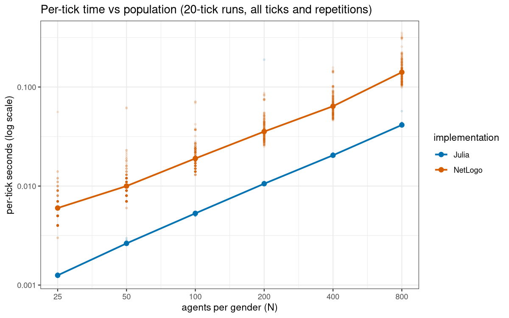
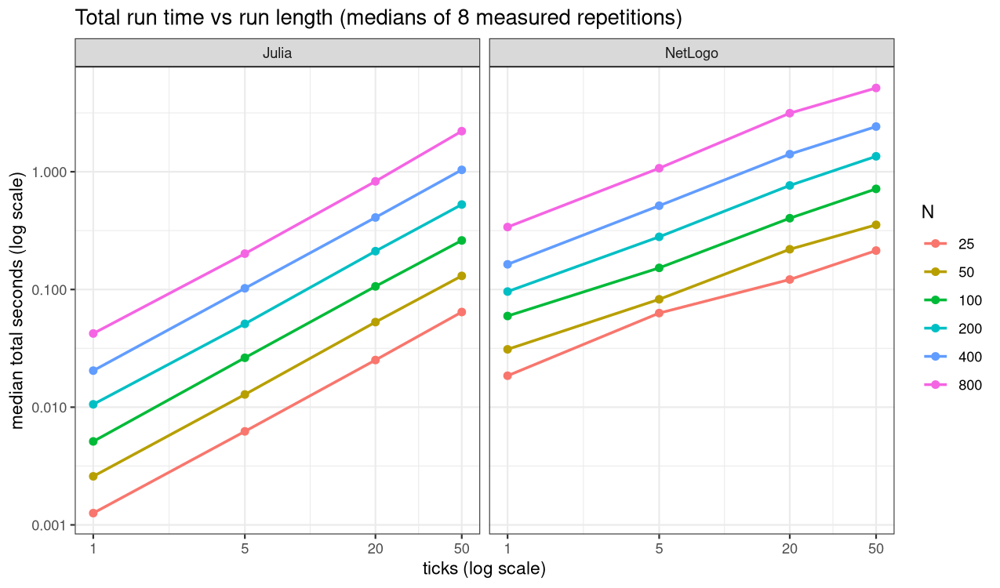
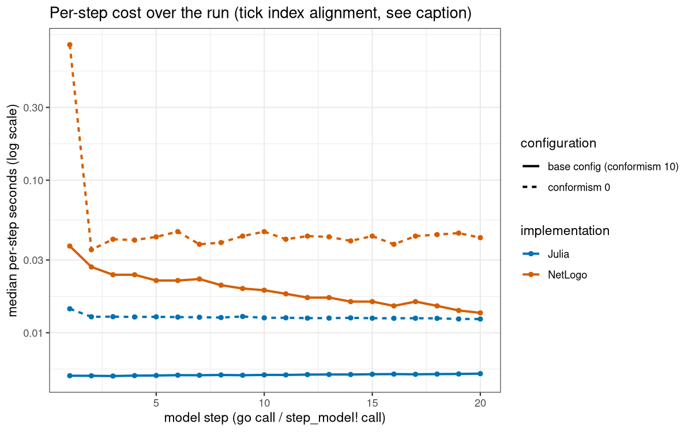

# Performance report: NetLogo reference model vs the Julia port

Runtime comparison of `gender_model_shocks_preferences.nlogox` (NetLogo
7.0.4 headless) and the `GenderNorms` Julia package on 39 matched
configurations. All numbers below are measured values from
`benchmark/results/` (primarily `summary.csv`, `cold_start.csv`, and the
per-tick series); statements about mechanism are labelled as
interpretation.

## Summary

**The Julia port is faster in every one of the 39 configurations on
warm runs**, by a factor of 1.75x (smallest, `net_homogeneous_mixing`)
to 41.0x (largest, `util_multiplicative_weighted`), with a median of
4.16x across the matrix and 3.79-3.91x at the base configuration (CES
utility, Watts-Strogatz network, 100 agents per gender, 20 ticks). 37 of
39 configurations are faster by at least 2x. The advantage is largest
for expensive utility functions (12-41x), short runs (8-15x at 1 tick),
and low conformism (6.2x at conformism 0); it is smallest for runs with
little network interaction (1.75-1.94x for homogeneous mixing and no
network), long runs (2.3-3.3x at 50 ticks), and high conformism (2.46x
at conformism 50). NetLogo's one advantage is startup: it delivers its
first result about 6.2 s sooner than a fresh Julia process, and within
every measured single-run horizon (up to 50 ticks) it finished first;
whether very long single runs cross over to Julia is left open by the
measurements (extrapolation only, no upper bound - see "Cold start").
For repeated work the startup amortizes after 3 to 360 runs per
configuration (median 21; the expensive configurations first), after
which the warm ratios above apply and the absolute gap grows with
population and with the work per run.

Verdict by parameter group (warm runs; speedup = median NetLogo total /
median Julia total):

| Group | Configs | Speedup range | Largest advantage | Smallest advantage |
| --- | --- | --- | --- | --- |
| `pop` (population x ticks) | 24 | 2.33x - 14.69x | `pop_n25_t1` (14.69x) | `pop_n800_t50` (2.33x) |
| `net` (network type) | 7 | 1.75x - 4.27x | `net_homophily` (4.27x) | `net_homogeneous_mixing` (1.75x) |
| `util` (utility function) | 4 | 3.91x - 41.01x | `util_multiplicative_weighted` (41.01x) | `util_ces` (3.91x) |
| `conf` (initial conformism) | 4 | 2.46x - 6.17x | `conf_0` (6.17x) | `conf_50` (2.46x) |

## What was measured

Two implementations of the same model:

- NetLogo reference: `gender_model_shocks_preferences.nlogox` run with
  `netlogo-headless.sh --threads 1` and one BehaviorSpace experiment per
  configuration.
- Julia port: the `GenderNorms` package at this working tree, driven
  through `GenderNorms.parse_spec` + `create_world` + `step_model!`
  (see `registry/code/decisions/ADR-0012-run-execution-pipeline.md`),
  single-threaded.

Timed scope on both sides is identical in shape: world setup plus the
model's tick loop (`setup` + `ticks` calls of `go` on the NetLogo side;
`create_world` + `ticks` calls of `step_model!` on the Julia side).
Configurations are matched one-to-one (every NetLogo global set
explicitly against the corresponding Julia run-specification key); the
full mapping is recorded in
`registry/model/decisions/MDR-0011-benchmark-methodology.md`. The
configuration matrix (39 configs in the groups `pop`, `net`, `util`,
`conf`) is defined in `benchmark/run_benchmarks.jl`; per-group details
are in the Results sections.

Environment (`benchmark/results/environment.txt`):

| Component | Value |
| --- | --- |
| CPU | AMD Ryzen 7 5825U (16 hardware threads) |
| RAM | 39849672 kB (about 38 GiB) |
| OS / kernel | Linux 7.2.6-arch2-1 |
| Julia | 1.12.7, single-threaded |
| NetLogo | 7.0.4 headless, `--threads 1` |
| Java | OpenJDK 21.0.12.1 |

## Methodology

Short version; the full contract is `MDR-0011`.

- Repetitions: 9 NetLogo runs per configuration in one JVM, run 1
  dropped as JIT warmup, 8 measured; Julia 2 warmup runs discarded, then
  8 measured. Reported totals are medians of the measured repetitions.
- NetLogo decomposition: one headless invocation per configuration with
  `runMetricsEveryStep = "true"`; each run emits one row per step
  including step 0, and the in-model `timer` (reset at the start of
  `setup`) gives setup time (`timer` at step 0), per-tick time
  (differences of `timer` between steps), and total (`timer` at the
  final step) from one internally consistent series. `run-time` at the
  final step cross-checks `timer` within the 1 ms timer resolution (1 of
  312 measured runs drifted 3 ms, `util_additive` run 6; the
  decomposition uses `timer` only, so `summary.csv` is unaffected).
- Julia decomposition: `time_ns()` around `create_world` and around each
  `step_model!` call; no GC forced between repetitions.
- Per-tick columns in `summary.csv`: `*_median_per_tick_s` is the median
  over repetitions of (total - setup) / ticks, i.e. the average tick
  cost of a run; `*_median_tick_first_s` / `*_median_tick_last_s` are
  medians of the first and last tick of the run.
- Timing noise: within-configuration spread of measured totals
  (max/min) has median 1.34 for NetLogo (worst 4.8 at `pop_n25_t1`,
  where the median total is 18.5 ms and the 1 ms timer resolution and
  system noise matter) and median 1.01 for Julia (worst 1.84). Medians
  are robust to this; per-repetition rows are in `netlogo_runs.csv` and
  `julia_runs.csv`.
- The RNG streams differ between implementations, so the
  configurations are matched but the trajectories are not
  bit-identical.

## Results

### Population and run length

Full `pop` sweep (median totals, 8 measured repetitions each; all
values from `summary.csv`):

| Agents per gender | Ticks | NetLogo median total (s) | Julia median total (s) | Speedup |
| --- | --- | --- | --- | --- |
| 25 | 1 | 0.018500 | 0.001259 | 14.688x |
| 25 | 5 | 0.063000 | 0.006229 | 10.113x |
| 25 | 20 | 0.121500 | 0.025150 | 4.831x |
| 25 | 50 | 0.214000 | 0.064327 | 3.327x |
| 50 | 1 | 0.031000 | 0.002586 | 11.990x |
| 50 | 5 | 0.082500 | 0.012820 | 6.435x |
| 50 | 20 | 0.219500 | 0.052818 | 4.156x |
| 50 | 50 | 0.354000 | 0.130436 | 2.714x |
| 100 | 1 | 0.059500 | 0.005118 | 11.627x |
| 100 | 5 | 0.152500 | 0.026273 | 5.805x |
| 100 | 20 | 0.403000 | 0.106225 | 3.794x |
| 100 | 50 | 0.715500 | 0.260857 | 2.743x |
| 200 | 1 | 0.096000 | 0.010573 | 9.080x |
| 200 | 5 | 0.280000 | 0.051042 | 5.486x |
| 200 | 20 | 0.765000 | 0.211514 | 3.617x |
| 200 | 50 | 1.352500 | 0.526628 | 2.568x |
| 400 | 1 | 0.163500 | 0.020439 | 7.999x |
| 400 | 5 | 0.514500 | 0.102289 | 5.030x |
| 400 | 20 | 1.411000 | 0.408744 | 3.452x |
| 400 | 50 | 2.420000 | 1.037660 | 2.332x |
| 800 | 1 | 0.339000 | 0.042259 | 8.022x |
| 800 | 5 | 1.071500 | 0.201537 | 5.317x |
| 800 | 20 | 3.144500 | 0.828739 | 3.794x |
| 800 | 50 | 5.148500 | 2.213004 | 2.326x |



Figure: per-tick seconds vs population at 20 ticks (raw per-tick values
of all 8 repetitions, log-log, medians overlaid). Near-parallel lines:
per-tick cost is approximately proportional to population over most of
the range (exact ratios in the table below).

Per-tick scaling at 20 ticks (from `summary.csv`; us/agent-tick =
per-tick seconds / (2N agents) in microseconds; "x2" is the ratio to the
previous population doubling):

| N | NetLogo per-tick (s) | Julia per-tick (s) | NetLogo us/agent-tick | Julia us/agent-tick | NetLogo x2 | Julia x2 |
| --- | --- | --- | --- | --- | --- | --- |
| 25 | 0.005900 | 0.001254 | 118.0 | 25.1 | - | - |
| 50 | 0.010700 | 0.002636 | 107.0 | 26.4 | 1.81x | 2.10x |
| 100 | 0.019825 | 0.005304 | 99.1 | 26.5 | 1.85x | 2.01x |
| 200 | 0.037975 | 0.010567 | 94.9 | 26.4 | 1.92x | 1.99x |
| 400 | 0.070000 | 0.020422 | 87.5 | 25.5 | 1.84x | 1.93x |
| 800 | 0.155975 | 0.041413 | 97.5 | 25.9 | 2.23x | 2.03x |

Scaling statement, honestly: per-tick cost is approximately
proportional to population on both sides, but neither side is exactly
linear and there is no universal error bound. Julia is proportional to
within measurement noise up to N = 400 (doubling ratios 1.93-2.10) and
slightly superlinear at the top doubling (2.03x); its per-agent cost
varies by only 5% across the whole 32x population range (25.1-26.5
us). NetLogo is mildly sublinear across most of the range - its
per-tick time grows 11.9x for the first 16x of population (N = 25 ->
400, about 26% below proportional) and 26.4x over the full 32x range -
and superlinear at the top doubling (2.23x for 400 -> 800).
Equivalently, NetLogo's per-agent cost varies by 35% over the range
(118 us at N = 25 falling to 87.5 us at N = 400, back to 97.5 us at
N = 800), consistent with a fixed per-tick overhead being amortized at
small populations. Linear extrapolation of NetLogo per-tick times can
therefore be off by a quarter or more depending on the endpoints
chosen.



Figure: median total time vs ticks per population, both
implementations (log-log). Total time grows clearly sublinearly in
ticks on both sides because per-tick cost declines over the run (next
section); the NetLogo curves bend more.

### Per-tick cost over the run

Per-tick cost is not constant. Medians of the first and last tick of
each run (`summary.csv` columns `*_median_tick_first_s` /
`*_median_tick_last_s`):

| Config | NetLogo first tick (s) | NetLogo last tick (s) | NetLogo decline | Julia first tick (s) | Julia last tick (s) |
| --- | --- | --- | --- | --- | --- |
| `pop_n100_t20` | 0.037 | 0.0135 | 2.7x | 0.005227 | 0.005394 |
| `pop_n800_t20` | 0.314 | 0.105 | 3.0x | 0.040526 | 0.042016 |
| `conf_0` | 0.773 | 0.042 | 18.4x | 0.01436 | 0.012301 |
| `conf_1` | 0.2255 | 0.007 | 32.2x | 0.011771 | 0.011290 |
| `conf_50` | 0.013 | 0.009 | 1.4x | 0.004067 | 0.004131 |

Measured shape (`netlogo_ticks.csv` / `julia_ticks.csv`, medians per
step): NetLogo's per-tick cost declines over the run - gradually at the
base configuration (0.037 s at tick 1 to about 0.014 s at tick 20) -
and at low conformism it is dominated by a single very expensive first
tick (`conf_0`: 0.773 s at tick 1, then flat at 0.035-0.045 s). Julia's
per-tick cost is nearly tick-invariant (within about 5%; at the base
config it even rises slightly, 0.00523 -> 0.00539 s).



Figure: median per-step seconds over the run for `pop_n100_t20` and
`conf_0`, both implementations. Alignment: NetLogo tick k is the k-th
`go` call, Julia tick j is the (j+1)-th `step_model!` call, plotted on
the common call index.

Interpretation (not measured): the declining NetLogo cost is consistent
with its solver doing less work as agents settle near their optima. In
the reference code, `choose-bundle` hill-climbs in discrete
`current-delta` (0.0001) steps while utility strictly improves and its
alternating sweeps stop once the joint change is at most
`convergence_epsilon`; `set-theta` stops at the first non-improving
theta step. Early in a run (and especially at low conformism, where the
weak norm penalty leaves agents far from their optima) each turn takes
long walks and many `calculate-utility` calls; later the walks shorten.
The Julia solver (continuous Brent maximization, see
`MDR-0002`/`MDR-0005`) performs a roughly tolerance-bounded number of
evaluations per call, so its per-step cost barely varies.

Consequence: the speedup ratio shrinks with run length (medians of
`speedup_netlogo_over_julia` over the `pop` sweep):

| N | T=1 | T=5 | T=20 | T=50 |
| --- | --- | --- | --- | --- |
| 25 | 14.69x | 10.11x | 4.83x | 3.33x |
| 50 | 11.99x | 6.44x | 4.16x | 2.71x |
| 100 | 11.63x | 5.81x | 3.79x | 2.74x |
| 200 | 9.08x | 5.49x | 3.62x | 2.57x |
| 400 | 8.00x | 5.03x | 3.45x | 2.33x |
| 800 | 8.02x | 5.32x | 3.79x | 2.33x |

The ratio falls from 8.0-14.7x at T=1 to 2.3-3.3x at T=50, but the
absolute time saved per run still grows with run length (e.g.
`pop_n100_t20`: 0.30 s saved per run vs 0.05 s at T=1).

### Network type

N = 100 per gender, T = 20 (`net` group; totals, setup and per-tick are
medians from `summary.csv`):

| Network | NetLogo total (s) | NetLogo setup (s) | NetLogo per-tick (s) | Julia total (s) | Julia setup (s) | Julia per-tick (s) | Speedup |
| --- | --- | --- | --- | --- | --- | --- | --- |
| `none` | 0.215 | 0.0050 | 0.010425 | 0.110689 | 0.000135 | 0.005527 | 1.94x |
| `watts_strogatz` | 0.403 | 0.0055 | 0.019875 | 0.103411 | 0.000131 | 0.005164 | 3.90x |
| `random` | 0.2955 | 0.0050 | 0.014525 | 0.104195 | 0.000116 | 0.005203 | 2.84x |
| `preferential_attachment` | 0.4305 | 0.0070 | 0.021150 | 0.105547 | 0.000135 | 0.005268 | 4.08x |
| `similarity` | 0.4445 | 0.0255 | 0.020750 | 0.104856 | 0.000843 | 0.005201 | 4.24x |
| `homophily` | 0.4485 | 0.0290 | 0.020700 | 0.105069 | 0.000897 | 0.005207 | 4.27x |
| `homogeneous_mixing` | 0.182 | 0.0055 | 0.008825 | 0.103744 | 0.000110 | 0.005182 | 1.75x |

NetLogo's total varies 2.5x across network types (0.18-0.45 s) while
Julia's is flat (0.103-0.111 s, 7% spread). The speedup therefore
tracks the network type: lowest where NetLogo has little neighbor work
(`homogeneous_mixing` 1.75x, `none` 1.94x - isolated agents skip the
neighbor-mean computations), highest on the linked topologies
(3.8-4.3x). Interpretation: the reference model recomputes the three
neighbor-norm means (`mean [old-working-time] of [link-neighbors]` and
the spouses-of-neighbors means) inside every `calculate-utility` call,
which is degree-sensitive per tick and per solver evaluation
(`MDR-0004` documents the Julia port computing these once per agent per
tick), while the Julia per-tick cost is almost network-independent at
this size. Setup: building similarity/homophily links with
`rnd:weighted-n-of` costs NetLogo 0.026-0.029 s vs about 0.005 s for
the other topologies (which use `nw:generate-*` or no links); Julia
setup is 30x cheaper there (0.0008-0.0009 s vs 0.0001 s) and still
negligible in absolute terms.

### Utility function

N = 100 per gender, T = 20 (`util` group):

| Utility | NetLogo total (s) | NetLogo per-tick (s) | Julia total (s) | Julia per-tick (s) | Speedup |
| --- | --- | --- | --- | --- | --- |
| `additive` | 0.290 | 0.014250 | 0.024468 | 0.001219 | 11.85x |
| `ces` | 0.405 | 0.020000 | 0.103538 | 0.005170 | 3.91x |
| `multiplicative` | 0.491 | 0.024275 | 0.023253 | 0.001158 | 21.12x |
| `multiplicative_weighted` | 2.8485 | 0.142175 | 0.069456 | 0.003465 | 41.01x |

The utility function is the single strongest lever on the ratio. On
NetLogo it changes total time by 9.8x (0.29 s to 2.85 s); on Julia by
4.4x (0.023 s to 0.104 s). Note the mirror image on the middle rows:
NetLogo's `multiplicative` branch (0.491 s) is slower than its `ces`
branch (0.405 s), while Julia's `multiplicative` (0.023 s) is its
fastest and its `ces` (0.104 s) its slowest. Interpretation: the Julia
`ces` branch evaluates `pow` calls where `additive`/`multiplicative`
use `sqrt`, and its solver iterations differ per surface
(`MDR-0002`); NetLogo's per-call cost and hill-climb length differ per
branch.

Verified quirk (fact, from the reference code in
`calculate-utility`): in the non-recipient branch of
`multiplicative including weights`, operator precedence binds the
outer exponent to the whole product - the code computes
`(income^pref * leisure)^(1 - pref) * exp(norm)` instead of the
`income^pref * leisure^(1 - pref) * exp(norm)` that the recipient
branch computes (parenthesized correctly there). This makes the two
partners face different utility surfaces. Hypothesis (not verified by
measurement): the distorted, asymmetric surface changes hill-climb
convergence and contributes to NetLogo's 9.8x spread over utility
functions, including the 41x maximum speedup for this branch.

Note added when this quirk was fixed in the port: the paragraph above
describes the NetLogo reference surface. The Julia port dropped the
quirk under `MDR-0019` (both roles compute
`income^pref * leisure^(1 - pref)`), and the measurements recorded
here predate that change and were taken under the quirk surface.

### Initial conformism

N = 100 per gender, T = 20 (`conf` group; conformism of both genders
equal):

| Conformism | NetLogo total (s) | NetLogo per-tick (s) | Julia total (s) | Julia per-tick (s) | Speedup |
| --- | --- | --- | --- | --- | --- |
| 0 | 1.5805 | 0.078700 | 0.256263 | 0.012688 | 6.17x |
| 1 | 0.7945 | 0.039500 | 0.229720 | 0.011478 | 3.46x |
| 10 | 0.417 | 0.020550 | 0.106626 | 0.005321 | 3.91x |
| 50 | 0.2025 | 0.009850 | 0.082302 | 0.004107 | 2.46x |

Lower conformism slows both implementations but NetLogo much more
(7.8x from conformism 50 to 0) than Julia (3.1x). Interpretation: the
norm penalty `-conformism * (deviation)^2` scales the curvature of the
utility surface; near zero conformism the surface is flat and the
solvers take longer to find optima (in NetLogo the extreme first-tick
costs of 0.77 s at conformism 0 and 0.23 s at conformism 1 - see the
per-tick section). The speedup ratio is largest at conformism 0 (6.17x)
and smallest at conformism 50 (2.46x), where NetLogo is already at its
fastest.

### Cold start and time to first result

Fresh-process startup (`cold_start.csv`):

| Measurement | Value |
| --- | --- |
| NetLogo JVM startup + model load (per invocation, 39 invocations) | 3.48 - 4.06 s (mean 3.65 s) |
| Julia fresh process to first result (`pop_n100_t20`, 3 processes) | 9.816 / 9.857 / 9.876 s (mean 9.85 s) |
| Extra Julia startup | about 6.20 s |

The Julia cold wall includes package load and JIT compilation plus one
first run of the base config; the NetLogo rows are process wall minus
the summed in-model timer series (startup + load only). Comparing
single-run wall times as W = startup + median warm total: NetLogo is
ahead at *every measured* combination - even the largest single run
(`pop_n800_t50`: W = 8.80 s NetLogo vs 12.06 s Julia). The warm
advantage of Julia is therefore not yet amortized at 50 ticks anywhere;
the crossover requires extrapolation beyond the measured range:

| N | W NetLogo at T=50 (s) | W Julia at T=50 (s) | Gap (s) | Scenario A: ticks to crossover | Scenario B: ticks to crossover |
| --- | --- | --- | --- | --- | --- |
| 25 | 3.87 | 9.91 | 6.05 | ~3450 | ~8790 |
| 50 | 4.01 | 9.98 | 5.97 | ~3200 | ~7100 |
| 100 | 4.37 | 10.11 | 5.74 | ~1140 | ~2680 |
| 200 | 5.01 | 10.38 | 5.37 | ~640 | ~1300 |
| 400 | 6.07 | 10.89 | 4.82 | ~430 | ~1310 |
| 800 | 8.80 | 12.06 | 3.26 | ~208 | ~364 |

Crossover computation (extrapolation, not bounds): both table columns
project per-tick rates measured at or before tick 50 into runs of
hundreds or thousands of ticks. They are two scenarios, not an
interval: scenario A assumes the average marginal rates of ticks 20-50
(from `summary.csv` totals) persist, scenario B assumes the end-of-run
rates at tick 50 (from `*_median_tick_last_s`, noisy at the 1 ms timer
resolution) persist. NetLogo's per-tick cost was still declining at
tick 50, so if it keeps declining the real crossover is later than
both scenarios, and the data establishes no upper bound - the crossover
may lie far beyond these numbers, or never occur if NetLogo's marginal
rate falls to Julia's level. What the measurements do establish: for a
single run, NetLogo's lower startup won every comparison within the
measured horizons (<= 50 ticks) at every population. As an expectation
conditional on the rate scenarios only: under scenario A the crossover
would fall inside the 1000-4000-tick horizon of the model's shipped
experiments for every population (about 200 ticks at N = 800 up to
3450 at N = 25); under scenario B for N >= 100 (about 360 to 2700
ticks) but not for N = 25-50 (7000-8800 ticks).

Startup is a one-time cost per process, so for sweeps and multi-run
sessions the question is instead how many runs amortize the 6.20 s
extra startup. Runs to break even per configuration are
K* = ceil(6.20 s / saving per run), with saving per run =
`netlogo_median_total_s - julia_median_total_s` from `summary.csv`
(positive for every config). Representative rows of the per-config
computation:

| Configuration | Saving per run (s) | Runs to break even |
| --- | --- | --- |
| `pop_n800_t20` | 2.32 | 3 |
| `util_multiplicative_weighted` | 2.78 | 3 |
| `pop_n800_t50` | 2.94 | 3 |
| `conf_0` | 1.32 | 5 |
| `pop_n400_t50` | 1.38 | 5 |
| `pop_n100_t20` (base config) | 0.30 | 21 |
| `util_ces` | 0.30 | 21 |
| `conf_50` | 0.12 | 52 |
| `net_none` | 0.10 | 60 |
| `pop_n50_t1` | 0.028 | 219 |
| `pop_n25_t1` | 0.017 | 360 |

Across all 39 configurations K* ranges from 3 to 360 runs with a median
of 21. Where the configs land: the 5 fastest to amortize (within 5
runs) are `pop_n800_t20`, `pop_n800_t50`, `util_multiplicative_weighted`
(3 runs each), `conf_0`, and `pop_n400_t50` (5 runs); 17 more configs
need 6-25 runs; 13 more need 26-100 runs; and 4 need over 100 runs -
`pop_n25_t5` (110), `pop_n100_t1` (115), `pop_n50_t1` (219), and
`pop_n25_t1` (360). Sweeps of expensive configurations therefore
amortize the startup in a handful of runs; sweeps of very cheap
configurations (single-tick runs at small populations) may need
hundreds of runs before Julia is ahead on wall time.

## Why the gap exists

Measured facts:

1. Different work per tick. The NetLogo reference computes strictly
   more per tick than the Julia port: `update-statistics` maintains
   10-element histories, moving averages, and the observer-set
   statistics that the Julia statistics core does not implement
   (`TASK-0001`, `MDR-0007`). The comparison is between the shipped
   NetLogo model and a partial port, so NetLogo's measured time
   includes work the Julia side does not attempt.
2. Different norm-perception strategy. NetLogo recomputes the
   neighbor-norm means inside every `calculate-utility` call (verified
   in the reference code; each solver step re-reads them), while the
   Julia port computes them once per agent per tick
   (`calculate_norm_perception!`, `MDR-0004`). This multiplies the
   neighbor work by the number of solver evaluations in NetLogo.
3. Different solvers. NetLogo searches a discrete theta grid in
   `set-theta` and hill-climbs `choose-bundle` in 0.0001 steps with an
   early stop; Julia solves continuous best responses with an in-repo
   Brent maximizer (`MDR-0002`, `MDR-0005`). The measured per-step
   decline and the utility-function sensitivity are consistent with
   these solver differences (interpretation).
4. Different runtime. NetLogo models run in an interpreter on the JVM
   with allocation-heavy agent/report evaluation; Julia code is
   compiled to native code. A rough baseline: per-agent per-tick cost
   is 87.5-118 us in NetLogo vs 25.1-26.5 us in Julia (about 3.4-4.7x)
   where the workload is comparable (the `pop` sweep at 20 ticks).

Explicit caveat: the measured ratio is **not a pure language
benchmark**. It combines language/runtime differences with the
documented algorithmic differences of items 1-3; a faithful re-port of
the NetLogo algorithms in Julia (or of the Julia algorithms in
NetLogo) would produce different ratios.

## Which model is faster

Direct answers, per situation:

| Situation | Faster | By |
| --- | --- | --- |
| Any warm configuration in this matrix | Julia | 1.75x - 41x (median 4.16x) |
| Single run from a cold start (measured horizons, <= 50 ticks) | NetLogo | won every measured comparison (up to about 6.2 s sooner) |
| Single long run (beyond 50 ticks) | undecided by measurement | crossover is extrapolated only: 208-8790 ticks by N and rate scenario, possibly later or never |
| Parameter sweeps / many runs per process | Julia after break-even | 3-360 runs per config (median 21); then the warm ratios apply |
| Linked networks (Watts-Strogatz, PA, similarity, homophily) | Julia | 3.9x - 4.3x |
| No/sparse networks (`none`, `homogeneous_mixing`) | Julia | 1.8x - 1.9x |
| CES utility | Julia | 3.9x |
| Additive / multiplicative / weighted-multiplicative utility | Julia | 12x / 21x / 41x |
| Low conformism (0-1) | Julia | 3.5x - 6.2x |
| High conformism (50) | Julia | 2.5x |

Practical guidance: use NetLogo only when a single interactive run must
appear instantly and the 3-4 s startup is acceptable while 10 s is
not. For repeated work, use the break-even counts above: sweeps of
expensive configurations (large populations, long runs, weighted
multiplicative utility, low conformism) amortize the startup in 3-10
runs and the warm speedups then apply run after run, while sweeps of
very cheap configurations (single-tick runs at small populations) may
need hundreds of runs. For a single very long run the measurements do
not decide: NetLogo won every comparison up to 50 ticks, and the
crossover beyond that depends on how NetLogo's still-declining per-tick
cost behaves at horizons the benchmark did not measure (the rate
scenarios of the cold-start section are expectations, not bounds).
Where Julia's warm advantage is largest regardless: the utility-function
branches NetLogo handles worst (weighted multiplicative) and run
segments where NetLogo's solver has not yet settled (early ticks, low
conformism).

## Limitations

- Workload mismatch: the Julia port is partial (statistics histories
  and observer sets not ported, `TASK-0001`) and uses different
  algorithms (norm caching `MDR-0004`, continuous solvers `MDR-0002` /
  `MDR-0005`), so the ratio is not a pure language benchmark.
- RNG streams differ between implementations: configurations are
  matched, trajectories are not bit-identical; per-run work can differ
  in detail.
- One machine (AMD Ryzen 7 5825U), one NetLogo/JVM/Julia version; JIT
  warmup handling is first-run-dropped (NetLogo) and 2 warmups
  (Julia), which favors neither side's warm numbers but is only one
  warmup policy.
- The NetLogo timer has 1 ms resolution; short-run and end-of-run
  per-tick values are quantized (visible in the small-population
  rows), and NetLogo run times show real machine noise (typical
  max/min spread 1.34 per config).
- No-shock path only (`shock = "no"`, `perc-affected-*` = 0 on the
  NetLogo side because Julia `select_affected!` is not wired into
  setup, `TASK-0007`); shock experiments could shift both sides.
- Warm runs dominate the results; the cold-start analysis covers one
  Julia config (`pop_n100_t20`) and derived NetLogo startup rows, and
  the single-run crossover is extrapolated beyond 50 ticks with no
  upper bound from the data (see "Cold start").
- The NetLogo timed scope includes BehaviorSpace's per-step evaluation
  of two trivial metric reporters (a small constant per-tick overhead
  in the conservative direction, see `MDR-0011`).

## Reproducing

Data collection and analysis (from the repository root):

```
julia --project=. benchmark/run_benchmarks.jl             # full 39-config matrix, both sides
julia --project=. benchmark/run_benchmarks.jl --cold-start # fresh-process startup probe
julia --project=. benchmark/run_benchmarks.jl --analyse    # rebuild merged CSVs from raw files
Rscript benchmark/make_figures.R                           # regenerate the figures
```

Data sources for this report (all under `benchmark/results/`):
`summary.csv` (all tables except cold start), `cold_start.csv` (startup
and crossover), `netlogo_ticks.csv` / `julia_ticks.csv` (per-step
curves), `netlogo_runs.csv` / `julia_runs.csv` (spread), and
`environment.txt` (environment table). Figures are generated into
`results/figures/` by `benchmark/make_figures.R`. The measurement
contract is `registry/model/decisions/MDR-0011-benchmark-methodology.md`;
the harness structure is
`registry/code/decisions/ADR-0013-benchmark-harness.md`.
